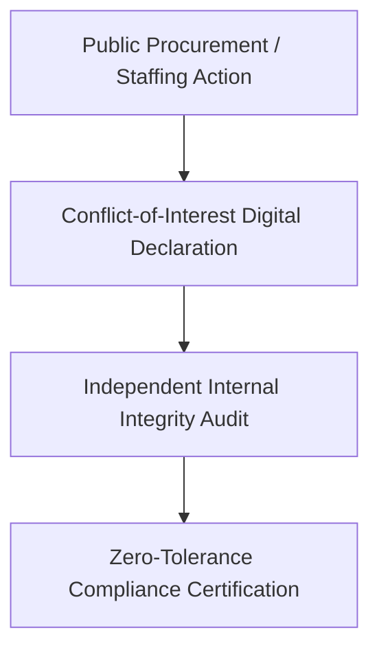

> **OPERATIONAL STATUS: WORKING DRAFT // NON-AUTHORITATIVE ACADEMIC REFERENCE**  
> *This document represents an applied research framework, operational systems draft, and quantitative governance model prepared for institutional capacity development. It does not constitute a formally submitted or statutory governmental/multilateral policy instrument and must not be cited as authoritative legal or official precedent.*

# UNDP-SDG16-INTEGRITY: Public Sector Whistleblower & Conflict-of-Interest Architecture

## 1. Executive Summary & Policy Context (5W+1H Alignment)
- **Sector Category:** 10 Multilateral Advisory Programs
- **Multilateral Alignment:** UN Sustainable Development Goals (SDGs) & National Statutory Standards.
- **Project Description:** A comprehensive institutional integrity framework for government line ministries establishing blind whistleblower intake and asset declaration auditing.

| Dimension | Specification |
| :--- | :--- |
| **WHAT** | A comprehensive institutional integrity framework for government line ministries establishing blind whistleblower intake and asset declaration auditing. |
| **WHY** | Critical human security and governance gap in current institutional infrastructure. |
| **WHO** | Marginalized beneficiaries, civil society partners, and public sector oversight bodies. |
| **WHERE** | Developing union councils, displacement settlements, and municipal jurisdictions. |
| **WHEN** | Operational working draft structured for immediate phased implementation. |
| **HOW** | Systems architecture, rigorous SOPs, and empirical indicators detailed below. |

---

## 2. Systems Workflow & Architecture

---

## 3. Quantitative Risk & Performance Indicator Matrix

| Performance Indicator | Baseline Metric | Target Milestone | Verification Method |
| :--- | :---: | :---: | :--- |
| **Coverage & Reach** | Unmonitored / 0 | 100% Target Population | Biometric / Field GPS Census |
| **Safeguarding Adherence** | Ad-hoc | Zero PSEA / Safety Violations | Independent Confidential Audit |
| **Operational Uptime / Integrity** | <50% | >98% Availability | Automated Digital Telemetry |
| **Statutory Compliance Score** | Incomplete | 100% Fully Compliant | Legal Register Verification |

---

## 4. Standard Operating Procedures (SOPs) & Implementation Checklist
1. **Preliminary Community Consent & Intake:** Structured consultation adhering to local cultural norms and Do No Harm mandates.
2. **Quality & Risk Controls:** Continuous monitoring against standardized safety registers and dual financial sign-offs.
3. **Adaptive Review & Feedback:** Monthly indicator review with citizen feedback escalation routes.
