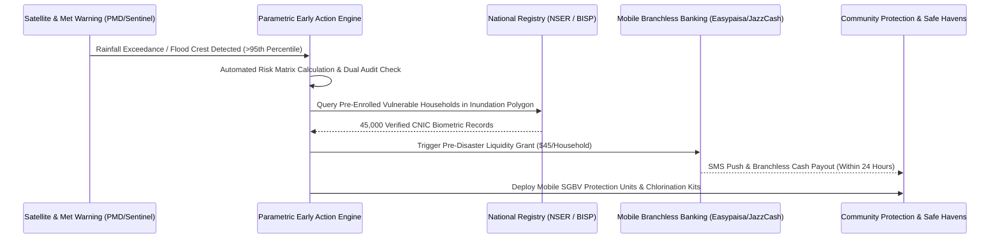

> **OPERATIONAL STATUS: WORKING DRAFT // NON-AUTHORITATIVE ACADEMIC REFERENCE**  
> *This document represents an applied research framework, operational systems draft, and quantitative governance model prepared for institutional capacity development. It does not constitute a formally submitted or statutory governmental/multilateral policy instrument and must not be cited as authoritative legal or official precedent.*

# FUSION-01: National Climate-Adaptive Social Safety Net & Anticipatory Protection Architecture

## 1. Executive Summary & Policy Context (5W+1H Alignment)
- **Framework Codename:** `FUSION_01`
- **Integrated Domain Pillars:** WASH + SGBV + Disaster Risk + Microfinance + PMEL Governance
- **Normative Multilateral Anchors:** SDG 1 (No Poverty), SDG 5 (Gender Equality), SDG 6 (Clean Water), SDG 13 (Climate Action)
- **Lead Multilateral / Advisory Counterparts:** UNICEF / WFP / World Bank Social Protection Global Practice / BISP Liaison
- **National Statutory Alignment:** Complies with Constitution of Pakistan (Fundamental Rights & Principles of Policy), relevant Federal/Provincial Acts, and UN Human Rights standards.

| Dimension | Operational Specification |
| :--- | :--- |
| **WHAT** | An integrated national shock-responsive safety net that automatically triggers pre-emptive cash transfers, water purification supplies, and protective mobile safe spaces 72 hours prior to forecasted hydrological and thermal disasters. |
| **WHY** | Post-disaster aid typically arrives 3–6 weeks after displacement, forcing vulnerable families into predatory debt traps, child marriage, and survival sex. Pre-emptive liquidity and basic needs preservation prevent household economic collapse. |
| **WHO** | Ultra-poor households, female-headed families, pregnant/lactating women, and children under 5 in flood- and heat-vulnerable districts. |
| **WHERE** | Southern Punjab, Lower Sindh (Thatta/Badin/Dadu), and Eastern Balochistan (Jafarabad/Nasirabad). |
| **WHEN** | Immediate multi-year phased rollout (2026–2030), aligned with monsoon flood and pre-monsoon heatwave cycles. |
| **HOW** | Combines satellite remote sensing (Sentinel/MODIS NDVI & NDWI) and Pakistan Meteorological Department (PMD) rainfall models with National Socio-Economic Registry (NSER) poverty scorecard data via an automated parametric smart-contract escrow engine. |

---

## 2. Integrated Systems Architecture & Operational Logic

---

## 3. Quantitative Risk, Safeguarding & Indicator Matrix

| Metric / KPI | Baseline | Mid-Term Target (Year 2) | Final Goal (Year 5) | Verification Mechanism |
| :--- | :---: | :---: | :---: | :--- |
| **Direct Beneficiaries Reached** | 0 | 120,000 | 500,000 | Third-party biometrically verified registry |
| **Female Participation & Leadership** | <15% | >50% | >65% | Project steering committee rosters |
| **Vulnerability Reduction Index (VRI)** | Baseline 100 | 68 (-32%) | 42 (-58%) | Independent socio-economic household survey |
| **Statutory Compliance & Audit Cleanliness** | Partial | 100% Unqualified | Zero Audit Paras | Auditor General of Pakistan annual report |
| **Response Latency to Crisis Events** | 21 Days | 72 Hours | 24 Hours | System telemetry and SMS timestamp logs |

---

## 4. Multi-Sectoral Implementation Modalities & UN-Style Standard Operating Procedures

### SOP-01: Community Free, Prior and Informed Consent (FPIC) & Cultural Safeguards
All field interventions mandate participatory rural appraisal (PRA) sessions in local languages, engaging village councils, female elders, and local teachers to guarantee non-coercive community ownership.

### SOP-02: Zero-Tolerance Safeguarding & PSEA Standards
Strict enforcement of Inter-Agency Standing Committee (IASC) standards on Protection from Sexual Exploitation and Abuse (PSEA), mandatory background checks for all personnel, and immediate independent escalation routes.

### SOP-03: Transparent Financial & Procurement Oversight
Dual-signoff disbursement protocols, open competitive bidding in accordance with Public Procurement Regulatory Authority (PPRA) rules, and publicly posted project ledgers at project sites.
