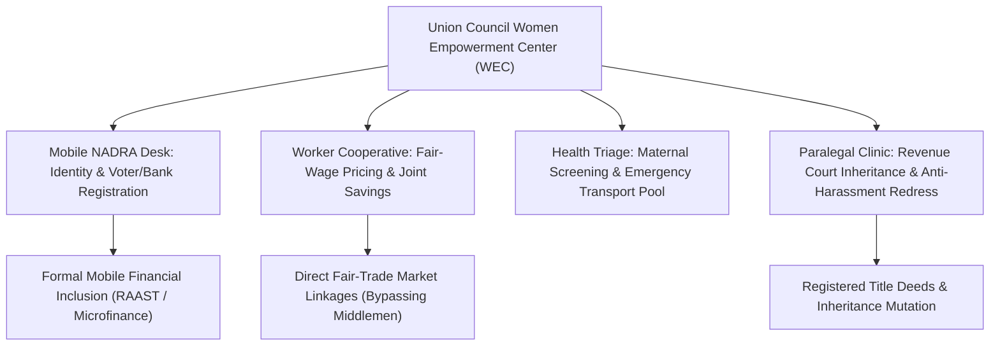

> **OPERATIONAL STATUS: WORKING DRAFT // NON-AUTHORITATIVE ACADEMIC REFERENCE**  
> *This document represents an applied research framework, operational systems draft, and quantitative governance model prepared for institutional capacity development. It does not constitute a formally submitted or statutory governmental/multilateral policy instrument and must not be cited as authoritative legal or official precedent.*

# FUSION-02: Developing-Area Women’s Integrated Legal, Financial & Reproductive Autonomy Nexus

## 1. Executive Summary & Policy Context (5W+1H Alignment)
- **Framework Codename:** `FUSION_02`
- **Integrated Domain Pillars:** Women's Legal Rights + Microfinance + SGBV + Reproductive Health + Civic Tech
- **Normative Multilateral Anchors:** SDG 3 (Good Health), SDG 5 (Gender Equality), SDG 8 (Decent Work), SDG 16 (Peace & Justice)
- **Lead Multilateral / Advisory Counterparts:** UN Women / UNFPA / NCSW / Provincial Women Development Departments
- **National Statutory Alignment:** Complies with Constitution of Pakistan (Fundamental Rights & Principles of Policy), relevant Federal/Provincial Acts, and UN Human Rights standards.

| Dimension | Operational Specification |
| :--- | :--- |
| **WHAT** | A comprehensive grassroots intervention package combining mobile civil identity (CNIC) registration, collective home-based worker cooperatives, community midwife obstetric tele-triage, and paralegal inheritance defense. |
| **WHY** | Rural women face interlocking barriers: without a CNIC they cannot own land or open a bank account; without independent income they cannot escape domestic violence; without reproductive healthcare maternal mortality remains high. |
| **WHO** | Home-based female artisans, agricultural tenant laborers, and young mothers in underdeveloped union councils. |
| **WHERE** | Rural union councils across Khyber Pakhtunkhwa, South Punjab, and rural Sindh. |
| **WHEN** | Continuous 3-year programmatic cycle with quarterly judicial and health milestone verifications. |
| **HOW** | Establishes Union Council Women Empowerment Centers (WECs) that provide one-stop service delivery: mobile NADRA van days, legal aid clinics, cooperative collective bargaining desks, and antenatal health checkups. |

---

## 2. Integrated Systems Architecture & Operational Logic

---

## 3. Quantitative Risk, Safeguarding & Indicator Matrix

| Metric / KPI | Baseline | Mid-Term Target (Year 2) | Final Goal (Year 5) | Verification Mechanism |
| :--- | :---: | :---: | :---: | :--- |
| **Direct Beneficiaries Reached** | 0 | 120,000 | 500,000 | Third-party biometrically verified registry |
| **Female Participation & Leadership** | <15% | >50% | >65% | Project steering committee rosters |
| **Vulnerability Reduction Index (VRI)** | Baseline 100 | 68 (-32%) | 42 (-58%) | Independent socio-economic household survey |
| **Statutory Compliance & Audit Cleanliness** | Partial | 100% Unqualified | Zero Audit Paras | Auditor General of Pakistan annual report |
| **Response Latency to Crisis Events** | 21 Days | 72 Hours | 24 Hours | System telemetry and SMS timestamp logs |

---

## 4. Multi-Sectoral Implementation Modalities & UN-Style Standard Operating Procedures

### SOP-01: Community Free, Prior and Informed Consent (FPIC) & Cultural Safeguards
All field interventions mandate participatory rural appraisal (PRA) sessions in local languages, engaging village councils, female elders, and local teachers to guarantee non-coercive community ownership.

### SOP-02: Zero-Tolerance Safeguarding & PSEA Standards
Strict enforcement of Inter-Agency Standing Committee (IASC) standards on Protection from Sexual Exploitation and Abuse (PSEA), mandatory background checks for all personnel, and immediate independent escalation routes.

### SOP-03: Transparent Financial & Procurement Oversight
Dual-signoff disbursement protocols, open competitive bidding in accordance with Public Procurement Regulatory Authority (PPRA) rules, and publicly posted project ledgers at project sites.
