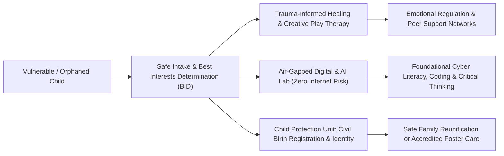

> **OPERATIONAL STATUS: WORKING DRAFT // NON-AUTHORITATIVE ACADEMIC REFERENCE**  
> *This document represents an applied research framework, operational systems draft, and quantitative governance model prepared for institutional capacity development. It does not constitute a formally submitted or statutory governmental/multilateral policy instrument and must not be cited as authoritative legal or official precedent.*

# FUSION-03: Holistic Child Safeguarding, Psychosocial Rehabilitation & Offline Digital Literacy System

## 1. Executive Summary & Policy Context (5W+1H Alignment)
- **Framework Codename:** `FUSION_03`
- **Integrated Domain Pillars:** Cyber/AI Education + Child Protection + SGBV + Trauma-Informed CFS + Civic Identity
- **Normative Multilateral Anchors:** SDG 4 (Quality Education), SDG 10 (Reduced Inequalities), SDG 16 (Child Protection)
- **Lead Multilateral / Advisory Counterparts:** UNICEF Child Protection & Education / National Commission on the Rights of Child (NCRC)
- **National Statutory Alignment:** Complies with Constitution of Pakistan (Fundamental Rights & Principles of Policy), relevant Federal/Provincial Acts, and UN Human Rights standards.

| Dimension | Operational Specification |
| :--- | :--- |
| **WHAT** | A multi-sectoral institutional architecture establishing safe physical-digital hubs in orphanages, welfare centers, and displaced camps, integrating child trauma healing with air-gapped cyber and AI literacy. |
| **WHY** | Vulnerable children in state care or disaster camps are exposed to digital exploitation, human trafficking, and severe cognitive stagnation. Providing safe, modern technological competencies breaks cyclical poverty without exposing them to predatory internet harms. |
| **WHO** | Orphaned children, unaccompanied displaced minors, street-connected youth, and children in foster shelters. |
| **WHERE** | Public orphanages (Dar-ul-Aman / SOS Villages), transit camps, and peri-urban shelter networks nationwide. |
| **WHEN** | Continuous academic and psychosocial calendar with bi-monthly case management reviews. |
| **HOW** | Deploys air-gapped local education servers running open-source curriculum content, structured trauma-informed play therapies, and biometrically protected case tracking under legal guardian oversight. |

---

## 2. Integrated Systems Architecture & Operational Logic

---

## 3. Quantitative Risk, Safeguarding & Indicator Matrix

| Metric / KPI | Baseline | Mid-Term Target (Year 2) | Final Goal (Year 5) | Verification Mechanism |
| :--- | :---: | :---: | :---: | :--- |
| **Direct Beneficiaries Reached** | 0 | 120,000 | 500,000 | Third-party biometrically verified registry |
| **Female Participation & Leadership** | <15% | >50% | >65% | Project steering committee rosters |
| **Vulnerability Reduction Index (VRI)** | Baseline 100 | 68 (-32%) | 42 (-58%) | Independent socio-economic household survey |
| **Statutory Compliance & Audit Cleanliness** | Partial | 100% Unqualified | Zero Audit Paras | Auditor General of Pakistan annual report |
| **Response Latency to Crisis Events** | 21 Days | 72 Hours | 24 Hours | System telemetry and SMS timestamp logs |

---

## 4. Multi-Sectoral Implementation Modalities & UN-Style Standard Operating Procedures

### SOP-01: Community Free, Prior and Informed Consent (FPIC) & Cultural Safeguards
All field interventions mandate participatory rural appraisal (PRA) sessions in local languages, engaging village councils, female elders, and local teachers to guarantee non-coercive community ownership.

### SOP-02: Zero-Tolerance Safeguarding & PSEA Standards
Strict enforcement of Inter-Agency Standing Committee (IASC) standards on Protection from Sexual Exploitation and Abuse (PSEA), mandatory background checks for all personnel, and immediate independent escalation routes.

### SOP-03: Transparent Financial & Procurement Oversight
Dual-signoff disbursement protocols, open competitive bidding in accordance with Public Procurement Regulatory Authority (PPRA) rules, and publicly posted project ledgers at project sites.
