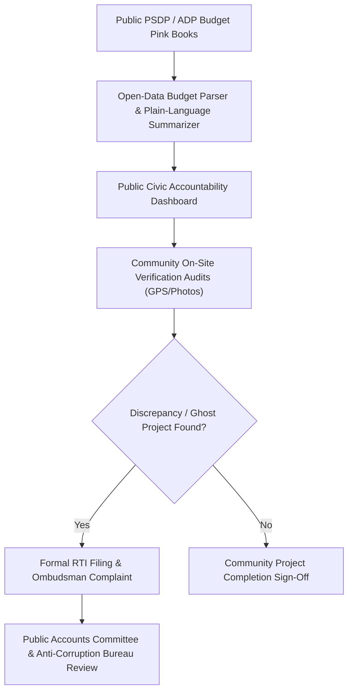

> **OPERATIONAL STATUS: WORKING DRAFT // NON-AUTHORITATIVE ACADEMIC REFERENCE**  
> *This document represents an applied research framework, operational systems draft, and quantitative governance model prepared for institutional capacity development. It does not constitute a formally submitted or statutory governmental/multilateral policy instrument and must not be cited as authoritative legal or official precedent.*

# FUSION-05: Master Civic Accountability, Public Expenditure Tracking & Pro-Poor Governance Architecture

## 1. Executive Summary & Policy Context (5W+1H Alignment)
- **Framework Codename:** `FUSION_05`
- **Integrated Domain Pillars:** Civic Tech + PMEL + Federal PC-1 Governance + Counter-Disinformation + Prison Reform
- **Normative Multilateral Anchors:** SDG 16 (Peace, Justice & Strong Institutions), SDG 17 (Partnerships for the Goals)
- **Lead Multilateral / Advisory Counterparts:** UNDP Democratic Governance / Transparency International Liaison / Federal & Provincial Ombudsmen
- **National Statutory Alignment:** Complies with Constitution of Pakistan (Fundamental Rights & Principles of Policy), relevant Federal/Provincial Acts, and UN Human Rights standards.

| Dimension | Operational Specification |
| :--- | :--- |
| **WHAT** | An institutional open-governance ecosystem integrating Right to Information (RTI) digital channels, municipal grievance heat-mapping, social audits of public procurement, and under-trial prisoner legal tracking. |
| **WHY** | Opacity in development budget utilization and slow judicial processing disproportionately harm the indigent, allowing public resources to leak while citizens remain unaware of their statutory legal rights. |
| **WHO** | Citizen watchdogs, community journalists, marginalized litigants, and civil society oversight coalitions. |
| **WHERE** | Municipal corporations, district courts, central prisons, and provincial government line departments. |
| **WHEN** | Continuous annual budget cycle and monthly judicial oversight sessions. |
| **HOW** | Unifies public data pipelines into accessible open-source dashboards, tracks civil petitions through automated SMS alerts, and trains community paralegals in executing third-party social audits of civil works. |

---

## 2. Integrated Systems Architecture & Operational Logic

---

## 3. Quantitative Risk, Safeguarding & Indicator Matrix

| Metric / KPI | Baseline | Mid-Term Target (Year 2) | Final Goal (Year 5) | Verification Mechanism |
| :--- | :---: | :---: | :---: | :--- |
| **Direct Beneficiaries Reached** | 0 | 120,000 | 500,000 | Third-party biometrically verified registry |
| **Female Participation & Leadership** | <15% | >50% | >65% | Project steering committee rosters |
| **Vulnerability Reduction Index (VRI)** | Baseline 100 | 68 (-32%) | 42 (-58%) | Independent socio-economic household survey |
| **Statutory Compliance & Audit Cleanliness** | Partial | 100% Unqualified | Zero Audit Paras | Auditor General of Pakistan annual report |
| **Response Latency to Crisis Events** | 21 Days | 72 Hours | 24 Hours | System telemetry and SMS timestamp logs |

---

## 4. Multi-Sectoral Implementation Modalities & UN-Style Standard Operating Procedures

### SOP-01: Community Free, Prior and Informed Consent (FPIC) & Cultural Safeguards
All field interventions mandate participatory rural appraisal (PRA) sessions in local languages, engaging village councils, female elders, and local teachers to guarantee non-coercive community ownership.

### SOP-02: Zero-Tolerance Safeguarding & PSEA Standards
Strict enforcement of Inter-Agency Standing Committee (IASC) standards on Protection from Sexual Exploitation and Abuse (PSEA), mandatory background checks for all personnel, and immediate independent escalation routes.

### SOP-03: Transparent Financial & Procurement Oversight
Dual-signoff disbursement protocols, open competitive bidding in accordance with Public Procurement Regulatory Authority (PPRA) rules, and publicly posted project ledgers at project sites.
