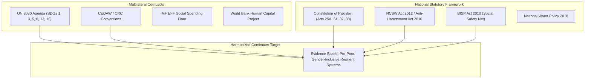

> **OPERATIONAL STATUS: WORKING DRAFT // NON-AUTHORITATIVE ACADEMIC REFERENCE**  
> *This document represents an applied research framework, operational systems draft, and quantitative governance model prepared for institutional capacity development. It does not constitute a formally submitted or statutory governmental/multilateral policy instrument and must not be cited as authoritative legal or official precedent.*

# Multilateral Socio-Economic Indicators & Policy Baseline (UN, World Bank, IMF, ADB)

## 1. Multilateral Institution Data Feeds & Verified Analytical Baselines

### A. World Bank Group (WBG) — Poverty & Equity Brief & Country Partnership Framework
- **Poverty Headcount Ratio ($3.65/day 2017 PPP):** Estimated at ~39.8% post-2022 macroeconomic shocks and flood destruction (World Bank Pakistan Development Update, Spring 2024).
- **Human Capital Index (HCI):** 0.41 — A child born in Pakistan today will be only 41% as productive as they could be with complete education and full health.
- **Stunting Rate in Children Under 5:** Nationally at ~40.2%, rising to >50% in rural districts of Sindh and Balochistan (National Nutrition Survey).
- **Primary Source Citations:**
  - *World Bank Open Data API:* Indicator `SI.POV.NAHC` (National Poverty Headcount), `SH.STA.STNT.ZS` (Stunting Prevalence).
  - *Country Partnership Framework (CPF) FY22-FY26:* Priority on human capital accumulation, climate resilience, and fiscal consolidation.

### B. International Monetary Fund (IMF) — Extended Fund Facility (EFF) Structural Benchmarks
- **Tax-to-GDP Ratio:** ~9.2% to 10.5% (one of the lowest regionally; IMF target: increase by 3 percentage points over 3 years).
- **BISP Social Protection Spending Floor:** Mandatory conditionality under IMF EFF 2024–2027 to protect targeted cash transfers to the lowest quintile against inflation and energy subsidy reforms.
- **Fiscal Space & Debt Servicing:** Public debt exceeding 74% of GDP, with interest payments consuming >55% of federal fiscal revenues, severely compressing social sector capital development budgets (PSDP).

### C. Asian Development Bank (ADB) — Post-Disaster Needs & Climate Vulnerability
- **2022 Floods Post-Disaster Needs Assessment (PDNA):** Total damages estimated at USD 14.9 billion; total economic losses at USD 15.2 billion; reconstruction needs estimated at USD 16.3 billion (ADB / WB / EU / UNDP joint validation).
- **Water Productivity & Scarcity:** Water availability per capita dropped from >5,000 m³ in 1951 to <900 m³ in 2024 (approaching absolute water scarcity threshold of 500 m³).
- **Climate Risk Ranking:** Pakistan consistently ranks among the top 10 countries most vulnerable to extreme climate events over the 2000–2020 Germanwatch Long-Term Climate Risk Index.

### D. United Nations (UNDP, UNICEF, UNFPA, UNHCR, UN Women)
- **UN Sustainable Development Cooperation Framework (UNSDCF 2023–2027):** 5 Strategic Priorities — Inclusive Economic Growth, Basic Social Services, Gender Equality & Women's Empowerment, Climate Resilience & WASH, and Governance & Human Rights.
- **Gender Inequality Index (GII):** Pakistan ranks 135 out of 166 countries (UNDP HDR 2023/2024), driven by low female labor force participation (~22%) and maternal mortality ratio (~186 per 100,000 live births).
- **Displaced Populations & Refugees:** Over 1.3 million registered Afghan refugees (POR cardholders) and an estimated 1.5 million undocumented/displaced individuals, presenting acute protection, documentation, and basic basic service delivery challenges.

---

## 2. Harmonized UN-National Policy Alignment Matrix

